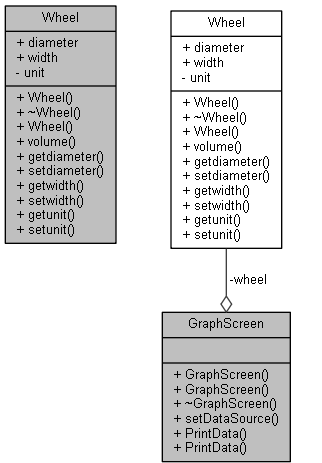
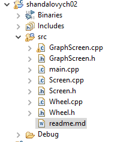
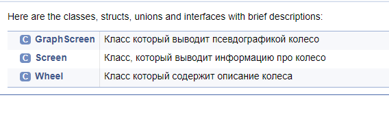
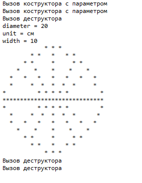

# Лабораторна робота № 2: Права доступу, const, покажчики посилання

## Мета 
Отримати навики при передаванні об'єктів із застосуванням прав доступу та const-модифікаторів.
## 1.ІНДИВІДУАЛЬНЕ ЗАВДАННЯ
Розподілити в `Wheel` права доступу private, public.
Реалызувати клас `GraphScreen` основна задача якого полягае у більш богатому відображеню даних `Wheel` із застосуванням псевдографіки для наочного відображення пов'язаного об'єкта.
`GraphScreen` повинен містити поля згідно опису в індивідуальному завданні та наступні методи:
- `SetDataSource()` - для зміни об'єкта-джерела даних.
-  `PrintData()` - виводитиме інформацію про отриманий об'єкт у якості аргументу.
Оновити `Screen` для збереження функціональності цього класу при роботі з оновленим `Wheel`. 

## 2.РОЗРОБКА ПРОГРАМИ
### 2.1 Засоби ООП
В ході розробки програми були використані такі засоби ООП:
- Абстракція - кожен об'єкт описує свою особливу сутність, яка визначається його полями.
- Інкапсуляція - поля об'єктів закриті для користувача,натомість ми даємо доступ до даних за допомогою геттерів та сеттерів, так користувач має можливість отримати готові дані, а не обробляти їх, для подпльшого вікористання. 

### 2.2 Іерархія та структура класів
На рис 2.1 дивись іерархію класів


<p align="center">



 Рисунок 2.1 іерархія класів
</p>


### 2.3 Опис програми
На рис 2.2 дивись структуру проекту.

<p align="center">


 Рисунок 2.2 структурa проекту
</p>

На рис 2.3 дивись призначення класів.


<p align="center">


 Рисунок 2.3 призначення класів
</p>

З попереднтої лабораторної роботи збереглися класи `Wheel` та `Screen`. У `Wheel` змінено модифікатори доступу, додано 2 методи, які виводять ширину та висоту вікна. Методи виводу класу `Screen` змінено, для коректної роботи з `private` та `public` полями. Додано класс `GraphScreen` у якому завдяки псевдографіки ми виводимо наш `Wheel`.

### 2.4 Важливі фрагменти програми
У программі слід зауважити увагу на таких моментах: 

#### Клас `GraphScreen` функція виведення даних за допомогою псевдографіки:

```
void GraphScreen::PrintData(const Wheel& wheel) {
	cout << "            * * *             \n";
	cout << "        * *   *   * *         \n";
	cout << "      * *     *     * *       \n";
	cout << "    *    *    *    *    *     \n";
	cout << "  *   *   *   *   *   *   *   \n";
	cout << "  *     *  *  *  *  *     *   \n";
	cout << "*         * * * * *         * \n";
	cout << "***************************** \n";
	cout << "*         * * * * *         * \n";
	cout << "  *     *  *  *  *  *      *  \n";
	cout << "  *   *   *   *   *   *   *   \n";
	cout << "    *    *    *    *    *     \n";
	cout << "      * *     *     * *       \n";
	cout << "        * *   *   * *         \n";
	cout << "            * * *             \n";

}

```


#### Демонстрація роботи програми:

```
int main(void) {

	//Константы для инициализации первого объекта.
	const int diameter = 20;
	const int width = 10;
	const string unit = "см";
	

	Wheel data( diameter, width, unit);

	Screen screen(data);

	screen.ViewWheel();

	GraphScreen view2(&data);
	view2.PrintData();

	return 0;
}

```


## 3.РЕЗУЛЬТАТИ РОБОТИ


Результат роботи показано на рис 3.1.


<p align="center">


 Рисунок 3.1 результат роботи
</p>

##ВИСНОВКИ
В результаті лабораторної роботи було розроблено програму з використанням прав доступу та const методів. Були придбані навички роботи з цими технологіями.